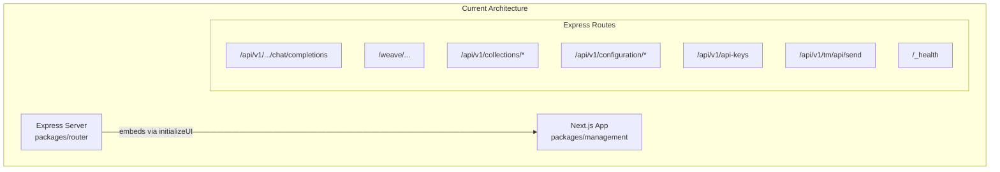
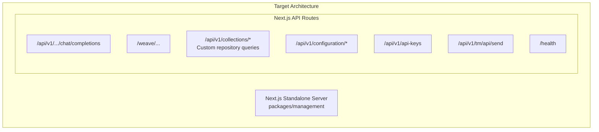

# Express to Next.js Migration Plan

After each step, validate whether pnpm lint:tsc passes. If it doesn't, fix the errors and update the plan.

## Current Architecture



## Target Architecture



## Key Files to Reference

- Express server entry: [`packages/router/src/server.ts`](packages/router/src/server.ts)
- DI initialization: [`packages/router/src/core/dependency-injection/initialize.ts`](packages/router/src/core/dependency-injection/initialize.ts)
- Management DI: [`packages/management/src/lib/core/get-container.ts`](packages/management/src/lib/core/get-container.ts)
- Chat completion handler: [`packages/router/src/modules/chat-completions/routes/chat-completion.ts`](packages/router/src/modules/chat-completions/routes/chat-completion.ts)
- Weave handler: [`packages/router/src/modules/weave/routes/process-request.ts`](packages/router/src/modules/weave/routes/process-request.ts)

---

## Phase 1: Infrastructure Setup

### 1.1 Update Next.js Configuration ✅

- Configure [`packages/management/next.config.ts`](packages/management/next.config.ts) for standalone output mode
- ~~Add necessary rewrites for route compatibility~~

> **Completed:** Added `output: "standalone"` to enable self-contained builds for Docker deployment.
>
> **Deviation from plan:** Rewrites were removed entirely instead of being added. The original rewrites forwarded requests to Express during development, but since Express is being fully replaced, they are no longer needed. All routes will be handled directly by Next.js API routes.

### 1.2 Consolidate Dependency Injection ✅

- Extend [`packages/management/src/lib/core/get-container.ts`](packages/management/src/lib/core/get-container.ts) to register all repositories currently initialized in the router package
- Move relevant services from `packages/router/src/modules/` to shared packages or management

> **Completed:** Extended `get-container.ts` to register all 8 repositories:
>
> - `PROVIDER_REPOSITORY`
> - `DEPLOYMENT_REPOSITORY`
> - `API_KEY_REPOSITORY`
> - `TENANT_REPOSITORY`
> - `NEXT_AUTH_USER_REPOSITORY`
> - `WEAVE_FLOW_REPOSITORY`
> - `LLM_FLOW_REPOSITORY`
> - `STORED_CONFIGURATION_REPOSITORY`
>
> **Note:** Moving services from router to shared packages will be done as needed during route migration phases.

### 1.3 Create Shared Middleware Utilities ✅

- Create Next.js-compatible middleware for:
- API key validation (from `check-api-key.ts`)
- Tenant resolution (from `get-tenant.ts`)
- Request ID generation (from `unique-id-middleware.ts`)
- Authentication checks (from `check-api-key-or-user.ts`)

> **Completed:** Created middleware utilities in `packages/management/src/lib/api/middleware/`:
>
> - `check-api-key.ts` - Validates API keys from Authorization header
> - `check-api-key-or-user.ts` - Validates either API key or user session
> - `get-tenant.ts` - Resolves tenant from ID or returns default tenant
> - `request-id.ts` - Generates unique request IDs
> - `handle-api-error.ts` - Error handler for API routes returning NextResponse
> - `errors.ts` - Error classes (ApplicationError, ApiKeyValidationError, etc.)
> - `constants.ts` - Shared constants (API_KEY_PREFIX, DEFAULT_TENANT_ID)
> - `break-down-api-key.ts` - Parses API key into ID and secret
> - `validate-api-key.ts` - Validates API key against hash using argon2
> - `generate-default-tenant.ts` - Creates default tenant object
> - `index.ts` - Exports all utilities

---

## Phase 2: Core API Routes Migration

### 2.1 Health Check ✅

- Create `/app/health/route.ts`

> **Completed:** Created health check route at `src/app/health/route.ts` - endpoint at `/health`, returns plain text `OK`.

### 2.2 Configuration Routes ✅

- `/app/api/v1/configuration/route.ts` - GET configuration
- `/app/api/v1/configuration/server/route.ts` - GET/POST server config

> **Completed:** Created configuration API routes:
>
> - `src/app/api/v1/configuration/route.ts` - GET endpoint requiring auth, returns tenant info, auth type, and version
> - `src/app/api/v1/configuration/server/route.ts` - GET (public) and POST (auth required) for server configuration
> - `src/lib/api/get-app-version.ts` - Utility to get app version from package.json with caching
>
> **Note:** Telemetry event sending was omitted from the POST handler as it will be handled separately in phase 6.

### 2.3 API Keys Route ✅

- `/app/api/v1/api-keys/route.ts` - POST create API key

> **Completed:** Created API keys route:
>
> - `src/app/api/v1/api-keys/route.ts` - POST endpoint requiring auth, creates LLM, Weave, or Management API keys
> - `src/lib/api/generate-api-key.ts` - Utility with `generateLlmApiKey`, `generateWeaveApiKey`, `generateManagementApiKey` functions using argon2 hashing

---

## Phase 3: Collections API (Custom Repository Queries) ✅

Replace SuperSave auto-generated routes with explicit API routes using repository pattern:

### 3.1 Create Collection Route Handlers ✅

For each collection (providers, deployments, api-keys, tenants, flows, etc.):

```javascript
/app/api/v1/collections/[collection]/route.ts      - GET (list), POST (create)
/app/api/v1/collections/[collection]/[id]/route.ts - GET, PUT, DELETE
```

> **Completed:** Created dynamic collection routes:
>
> - `src/app/api/v1/collections/[collection]/route.ts` - GET (list with query params), POST (create)
> - `src/app/api/v1/collections/[collection]/[id]/route.ts` - GET, PUT, DELETE for individual entities
>
> **Supporting utilities:**
>
> - `src/lib/api/collections/types.ts` - Collection name mapping to repository type symbols
> - `src/lib/api/collections/query-helpers.ts` - Query building with tenant filtering, pagination, sorting
> - `src/lib/api/collections/transform-entity.ts` - Entity transformation (removes tenantId, hash, apiKey)
>
> **Collections supported:** provider, deployment, apiKey, tenant, weaveflow, llmflow, storedconfiguration

### 3.2 Implement Query Helpers ✅

Create query builder utilities in `packages/management/src/lib/api/collections/query-helpers.ts`:

```typescript
export const addTenantIdToQuery = (query: Query, tenantId: string) => {
  return query.eq("tenantId", tenantId);
};
```

> **Completed:** Implemented `buildQuery()` and `parseQueryParams()` functions supporting:
>
> - Tenant ID filtering (automatic)
> - Custom filters via query params
> - Pagination (limit, offset)
> - Sorting (sort, order)

### 3.3 Collection Types to Support ✅

- `provider` - LLM/Weave provider configurations
- `deployment` - Deployment configurations
- `apiKey` - API key records
- `tenant` - Tenant records (if multi-tenant)
- `llmflow` - LLM flow configurations
- `weaveflow` - Weave flow configurations
- `storedconfiguration` - Server configuration storage

---

## Phase 4: LLM Chat Completions Migration ✅

### 4.1 Create Dynamic Route Structure ✅

```javascript
/app/api/v1/[deploymentSlug]/chat/completions/route.ts
/app/api/v1/[deploymentSlug]/models/route.ts
/app/api/v1/[tenantPath]/[deploymentSlug]/chat/completions/route.ts
/app/api/v1/[tenantPath]/[deploymentSlug]/models/route.ts
```

> **Completed:** Created routes at:
>
> - `src/app/api/v1/[deploymentSlug]/chat/completions/route.ts` - non-tenant path
> - `src/app/api/v1/[deploymentSlug]/models/route.ts` - non-tenant path
> - `src/app/api/v1/[tenantPath]/[deploymentSlug]/chat/completions/route.ts` - tenant-specific path
> - `src/app/api/v1/[tenantPath]/[deploymentSlug]/models/route.ts` - tenant-specific path
>
> **Shared handlers:** `src/lib/llm/handlers/` contains shared logic to minimize duplication:
>
> - `chat-completions.ts` - Core chat completion handling
> - `models.ts` - Core models handling

### 4.2 Migrate Chat Completion Handler ✅

- Move `ChatCompletionHandler` logic to Next.js route handler
- Implement SSE streaming using Next.js `ReadableStream` response
- Port LLM provider proxies (OpenAI, Google, Static)

> **Completed:** Created LLM infrastructure:
>
> - `src/lib/llm/types.ts` - OpenAI-compatible types
> - `src/lib/llm/providers/openai.ts` - OpenAI/compatible provider using AI SDK
> - `src/lib/llm/providers/google.ts` - Google AI provider using AI SDK
> - `src/lib/llm/providers/static.ts` - Static test provider
> - `src/lib/llm/request-mapper.ts` - Maps OpenAI params to AI SDK params
> - `src/lib/llm/stream-response.ts` - Converts AI SDK streams to SSE format
> - `src/lib/llm/execute-llm.ts` - Executes LLM with flow pipeline support
> - `src/lib/llm/get-deployment-by-slug.ts` - Fetches deployment by slug
>
> **Dependencies added:** `ai`, `@ai-sdk/google`, `@ai-sdk/openai-compatible`

### 4.3 Migrate Models Endpoint ✅

- Port `ModelsHandler` to Next.js route

> **Completed:** Created models endpoint with CORS support

---

## Phase 5: Weave Proxy Migration

### 5.1 Create Catch-All Route ✅

```javascript
/app/weave/[deploymentSlug]/[[...path]]/route.ts
/app/weave/[tenantPath]/[deploymentSlug]/[[...path]]/route.ts
```

> **Completed:** Created routes at:
>
> - `src/app/weave/[deploymentSlug]/[[...path]]/route.ts` - non-tenant path (single-tenant mode)
> - `src/app/weave/[tenantPath]/[deploymentSlug]/[[...path]]/route.ts` - tenant-specific path (multi-tenant mode)
>
> **Shared handler:** `src/lib/weave/handlers/weave-proxy.ts`

### 5.2 Implement All HTTP Methods ✅

> **Completed:**
>
> - Exported handlers for GET, POST, PUT, DELETE, PATCH, OPTIONS, HEAD
> - Ported `ProcessRequest` handler logic to `handleWeaveProxy`
> - Maintained request/response header forwarding
> - Implemented flow event execution (incomingRequest/response)
> - Support for `http-proxy` and `http-static` provider types
> - API key validation only when `deployment.requiresApiKey` is true

---

## Phase 6: Telemetry Migration ✅

### 6.1 Create Telemetry Route ✅

> **Completed:** Created at `src/app/api/v1/tm/api/send/route.ts`
>
> - Forwards analytics from frontend to Umami
> - Respects dev mode and telemetry enabled settings
> - Adds website ID and client IP to payload

### 6.2 Add Missing Telemetry Events ✅

**Telemetry infrastructure** (`src/lib/telemetry/`):

- `types.ts` - Event type definitions
- `send-event.ts` - Event sending with retry logic
- Added `TELEMETRY_SITE_ID` and `TELEMETRY_HOST_URL` to environment

**Collection creation events** (in `src/app/api/v1/collections/[collection]/route.ts`):

- ✅ `{ type: 'create', entity: 'deployment' }` - when creating deployments
- ✅ `{ type: 'create', entity: 'provider' }` - when creating providers
- ✅ `{ type: 'create', entity: 'apiKey' }` - when creating API keys
- ✅ `{ type: 'create', entity: 'llmflow' }` - when creating LLM flows
- ✅ `{ type: 'create', entity: 'weaveflow' }` - when creating Weave flows

**Server configuration events** (in `src/app/api/v1/configuration/server/route.ts`):

- ✅ `{ type: 'telemetry-disabled' }` - when user disables telemetry
- ✅ `{ type: 'telemetry-enabled' }` - when user enables telemetry
- ✅ `{ type: 'registered' }` - after telemetry is enabled (with new server identifier)

---

## Phase 7: Cleanup & Finalization

### 7.1 Update Dockerfile ✅

- Remove router package deployment
- Build and run only the management package
- Update CMD to use `next start`

> **Completed:** Updated Dockerfile for Next.js standalone deployment:
>
> - Removed router package deployment (`pnpm deploy --prod --filter @genie-nexus/router`)
> - Changed to copy Next.js standalone output from `.next/standalone`
> - Added static assets copy (`.next/static`, `public`)
> - Updated CMD from `node dist/server.js` to `node server.js`
> - Added `HOSTNAME=0.0.0.0` environment variable for Next.js
> - Updated health check from `/_health` to `/health`
>
> **Documentation updated:**
>
> - `docs/docs/installation/docker.md` - Updated health check path
> - `docs/docs/installation/docker-compose.md` - Updated health check path in example

### 7.2 Remove Express Dependencies ✅

- Remove `@auth/express` from router
- Clean up unused Express-specific code
- Consider removing or archiving `packages/router`

> **Completed:** Removed the entire `packages/router` directory since all functionality has been migrated to Next.js API routes in the management package.
>
> **Removed:**
>
> - Express server and all Express-specific middleware
> - `@auth/express` dependency
> - All router modules (chat-completions, weave, api-key, configuration, telemetry, etc.)
> - Router-specific dependency injection initialization

### 7.3 Update Server-Side API Calls ✅

- Refactor [`packages/management/src/lib/api/server-api.ts`](packages/management/src/lib/api/server-api.ts) to call repositories directly instead of HTTP fetch

> **Completed:** Refactored `server-api.ts` to use direct repository calls:
>
> - Replaced HTTP fetch with direct repository queries via `getContainer()`
> - Added `normalizeCollectionName()` to handle plural collection names (e.g., 'deployments' → 'deployment')
> - `getEntity()` - uses `repository.getById()` with tenant verification
> - `createEntity()` - uses `repository.create()` with automatic tenantId injection
> - `getEntityByQuery()` - uses `repository.getByQuery()` with parsed query params
> - `getEntities()` - uses `repository.getByQuery()` for multiple results
> - `getConfiguration()` - assembles configuration directly without HTTP call
> - `getResponseFromApi()` - only supports `/configuration/server` path, calls repository directly
>
> **Benefits:**
>
> - Eliminates HTTP overhead for server components
> - No more self-referential HTTP calls within the same process
> - Simpler authentication flow (server components already verified)

### 7.4 Update Tests ✅

- Migrate integration tests to work with Next.js
- Update Playwright tests if needed

> **Completed:** Updated test infrastructure:
>
> - Updated `tests/run-local.sh` to only start the management package (removed router startup)
> - Increased sleep time to 5s to allow Next.js dev server more startup time
> - Simplified cleanup to only manage single process
> - No changes needed for Playwright or vitest configs (already use dynamic `TEST_BASE_URL`)
> - API tests in `tests/api/` work unchanged as they use the same endpoints

### 7.5 Update Documentation ✅

- Update installation docs
- Update Docker Compose configuration

> **Completed:** Documentation updates:
>
> - Updated `docs/docs/configuration/settings.md` - Changed "router server" to "server"
> - Health check path updates were done in phase 7.1:
>   - `docs/docs/installation/docker.md` - Updated from `/_health` to `/health`
>   - `docs/docs/installation/docker-compose.md` - Updated health check in example

---

## Migration Order (Recommended)

1. Infrastructure (Phase 1) - Foundation for everything else
2. Health check (Phase 2.1) - Simple, validates setup
3. Configuration routes (Phase 2.2-2.3) - Management UI depends on these
4. Collections API (Phase 3) - Core CRUD operations
5. Chat completions (Phase 4) - Core LLM functionality
6. Weave proxy (Phase 5) - HTTP proxy functionality
7. Telemetry (Phase 6) - Analytics
8. Cleanup (Phase 7) - Remove old code

---

## Risk Considerations

- **Streaming responses**: Next.js handles SSE differently than Express; requires `ReadableStream` approach
- **Catch-all routes**: Weave proxy needs careful path handling with Next.js dynamic routes
