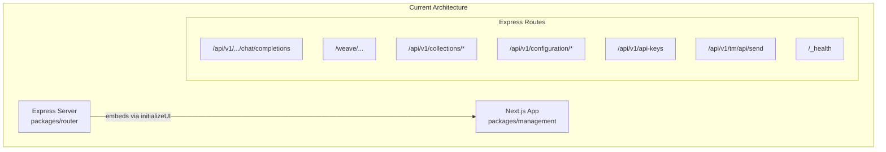
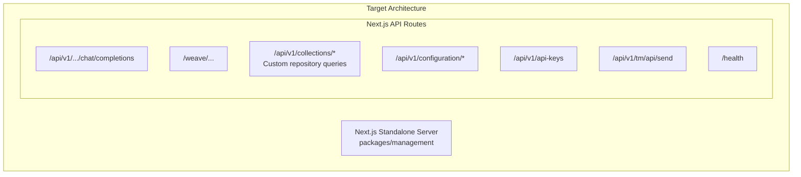

# Express to Next.js Migration Plan

## Current Architecture



## Target Architecture



## Key Files to Reference

- Express server entry: [`packages/router/src/server.ts`](packages/router/src/server.ts)
- DI initialization: [`packages/router/src/core/dependency-injection/initialize.ts`](packages/router/src/core/dependency-injection/initialize.ts)
- Management DI: [`packages/management/src/lib/core/get-container.ts`](packages/management/src/lib/core/get-container.ts)
- Chat completion handler: [`packages/router/src/modules/chat-completions/routes/chat-completion.ts`](packages/router/src/modules/chat-completions/routes/chat-completion.ts)
- Weave handler: [`packages/router/src/modules/weave/routes/process-request.ts`](packages/router/src/modules/weave/routes/process-request.ts)

---

## Phase 1: Infrastructure Setup

### 1.1 Update Next.js Configuration ✅

- Configure [`packages/management/next.config.ts`](packages/management/next.config.ts) for standalone output mode
- ~~Add necessary rewrites for route compatibility~~

> **Completed:** Added `output: "standalone"` to enable self-contained builds for Docker deployment.
>
> **Deviation from plan:** Rewrites were removed entirely instead of being added. The original rewrites forwarded requests to Express during development, but since Express is being fully replaced, they are no longer needed. All routes will be handled directly by Next.js API routes.

### 1.2 Consolidate Dependency Injection

- Extend [`packages/management/src/lib/core/get-container.ts`](packages/management/src/lib/core/get-container.ts) to register all repositories currently initialized in the router package
- Move relevant services from `packages/router/src/modules/` to shared packages or management

### 1.3 Create Shared Middleware Utilities

- Create Next.js-compatible middleware for:
- API key validation (from `check-api-key.ts`)
- Tenant resolution (from `get-tenant.ts`)
- Request ID generation (from `unique-id-middleware.ts`)
- Authentication checks (from `check-api-key-or-user.ts`)

---

## Phase 2: Core API Routes Migration

### 2.1 Health Check

- Create `/app/health/route.ts` and `/_health/route.ts`

### 2.2 Configuration Routes

- `/app/api/v1/configuration/route.ts` - GET configuration
- `/app/api/v1/configuration/server/route.ts` - GET/POST server config

### 2.3 API Keys Route

- `/app/api/v1/api-keys/route.ts` - POST create API key

---

## Phase 3: Collections API (Custom Repository Queries)

Replace SuperSave auto-generated routes with explicit API routes using repository pattern:

### 3.1 Create Collection Route Handlers

For each collection (providers, deployments, api-keys, tenants, flows, etc.):

```javascript
/app/api/v1/collections/[collection]/route.ts      - GET (list), POST (create)
/app/api/v1/collections/[collection]/[id]/route.ts - GET, PUT, DELETE
```

### 3.2 Implement Query Helpers

Create query builder utilities in `packages/management/src/lib/api/query-helpers.ts`:

```typescript
export const addTenantIdToQuery = (query: Query, tenantId: string) => {
  return query.eq("tenantId", tenantId);
};
```

### 3.3 Collection Types to Support

- `providers` - LLM/Weave provider configurations
- `deployments` - Deployment configurations
- `api-keys` - API key records
- `tenants` - Tenant records (if multi-tenant)
- `llm-flows` - LLM flow configurations
- `weave-flows` - Weave flow configurations
- `stored-configuration` - Server configuration storage

---

## Phase 4: LLM Chat Completions Migration

### 4.1 Create Dynamic Route Structure

```javascript
/app/api/v1/[deploymentSlug]/chat/completions/route.ts
/app/api/v1/[deploymentSlug]/models/route.ts
```

(Or with tenant path if multi-tenant: `/app/api/v1/[tenantPath]/[deploymentSlug]/...`)

### 4.2 Migrate Chat Completion Handler

- Move `ChatCompletionHandler` logic to Next.js route handler
- Implement SSE streaming using Next.js `ReadableStream` response
- Port LLM provider proxies (OpenAI, Google, Static)

### 4.3 Migrate Models Endpoint

- Port `ModelsHandler` to Next.js route

---

## Phase 5: Weave Proxy Migration

### 5.1 Create Catch-All Route

```javascript
/app/weave/[deploymentSlug]/[[...path]]/route.ts
```

(With tenant support if needed)

### 5.2 Implement All HTTP Methods

- Export handlers for GET, POST, PUT, DELETE, PATCH, OPTIONS, HEAD
- Port `ProcessRequest` handler logic
- Maintain request/response header forwarding

---

## Phase 6: Telemetry Migration

### 6.1 Create Telemetry Route

- `/app/api/v1/tm/api/send/route.ts`
- Port telemetry forwarding logic

---

## Phase 7: Cleanup & Finalization

### 7.1 Update Dockerfile

- Remove router package deployment
- Build and run only the management package
- Update CMD to use `next start`

### 7.2 Remove Express Dependencies

- Remove `@auth/express` from router
- Clean up unused Express-specific code
- Consider removing or archiving `packages/router`

### 7.3 Update Server-Side API Calls

- Refactor [`packages/management/src/lib/api/server-api.ts`](packages/management/src/lib/api/server-api.ts) to call repositories directly instead of HTTP fetch

### 7.4 Update Tests

- Migrate integration tests to work with Next.js
- Update Playwright tests if needed

### 7.5 Update Documentation

- Update installation docs
- Update Docker Compose configuration

---

## Migration Order (Recommended)

1. Infrastructure (Phase 1) - Foundation for everything else
2. Health check (Phase 2.1) - Simple, validates setup
3. Configuration routes (Phase 2.2-2.3) - Management UI depends on these
4. Collections API (Phase 3) - Core CRUD operations
5. Chat completions (Phase 4) - Core LLM functionality
6. Weave proxy (Phase 5) - HTTP proxy functionality
7. Telemetry (Phase 6) - Analytics
8. Cleanup (Phase 7) - Remove old code

---

## Risk Considerations

- **Streaming responses**: Next.js handles SSE differently than Express; requires `ReadableStream` approach
- **Catch-all routes**: Weave proxy needs careful path handling with Next.js dynamic routes
